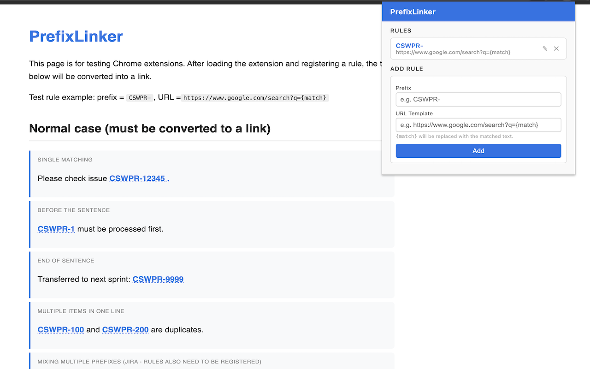

# PrefixLinker

A Chrome extension that automatically turns prefix-matched text into clickable links — no more copy-pasting ticket numbers into a search bar.



---

## How it works

You configure one or more rules, each consisting of a **prefix** and a **URL template**:

| Prefix | URL Template |
|--------|-------------|
| `CSWPR-` | `https://www.google.com/search?q={match}` |
| `JIRA-` | `https://jira.example.com/browse/{match}` |

Whenever text matching a prefix is found on any page (e.g. `CSWPR-12345`), the extension wraps it in a clickable link. The `{match}` placeholder in the URL template is replaced with the detected text.

Dynamic content (SPAs, infinite scroll, lazy-loaded sections) is handled in real time via `MutationObserver`.

---

## Installation

### From Chrome Web Store
> Coming soon.

### Manual (developer mode)
1. Clone or download this repository.
2. Open Chrome and go to `chrome://extensions`.
3. Enable **Developer mode** (top-right toggle).
4. Click **Load unpacked** and select the `extension/` folder.
5. The PrefixLinker icon appears in your toolbar.

---

## Usage

1. Click the **PrefixLinker** icon in the toolbar.
2. Enter a **Prefix** (e.g. `CSWPR-`) and a **URL Template** (e.g. `https://www.google.com/search?q={match}`).
3. Click **Add**.
4. Reload any page — matching text becomes a clickable link.

A default rule (`CSWPR-` → Google Search) is registered automatically on first install.

Rules are stored via `chrome.storage.sync` and synced across all your signed-in Chrome instances.

---

## Development

### Prerequisites
- Node.js (any LTS)
- npm

### Setup
```bash
git clone <repo-url>
cd prefixLinker
npm ci
```

### Project structure
```
prefixLinker/
├── src/core.js           # Pure business logic (no DOM/browser deps)
├── tests/
│   ├── core.test.js      # Unit tests for src/core.js
│   ├── content.test.js   # jsdom tests for the content script
│   └── popup.test.js     # jsdom tests for the popup
├── extension/
│   ├── manifest.json     # MV3 manifest
│   ├── core.js           # Copy of src/core.js (loaded by content script)
│   ├── content.js        # DOM scanner + MutationObserver
│   ├── background.js     # Service worker — sets default rule on install
│   ├── popup.html        # Rule management UI
│   ├── popup.js          # Popup logic
│   └── icons/            # Extension icons (16, 48, 128 px + store icon)
├── docs/screenshots/     # Screenshots for README and store listing
└── test.html             # Manual browser integration test page
```

### Commands
```bash
npm test              # Run all unit tests
npm run test:watch    # Watch mode
npm run test:coverage # Coverage report
npm run build         # Sync src/core.js → extension/core.js
```

### Testing
The project uses **Jest** with **jsdom** for all automated tests. Core business logic lives in `src/core.js` and is tested independently of any browser API.

When working on the content script or popup, open `test.html` in Chrome after loading the extension to run the manual integration test page.

### Packaging for the Chrome Web Store
```bash
zip -r prefixLinker.zip extension/ --exclude "*.DS_Store"
```

Upload `prefixLinker.zip` and `docs/screenshots/screenshot.png` (+ `extension/icons/store_icon.png` as the store icon) to the [Chrome Web Store Developer Dashboard](https://chrome.google.com/webstore/devconsole).

---

## License

Apache License 2.0 — see [LICENSE](LICENSE) for details.
